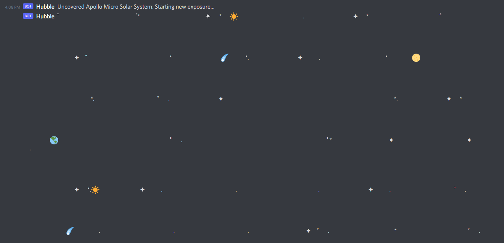

# Discord-Starfields
Generate random starfields with unique names for discord!

## Usage:
First add your webhook url in starfields.py
#### Build and deploy the starfield bot on docker
> sudo ./control.sh build

#### Start the starfield bot
> sudo ./control.sh start

#### Stop the starfield bot
>sudo ./control.sh stop 

